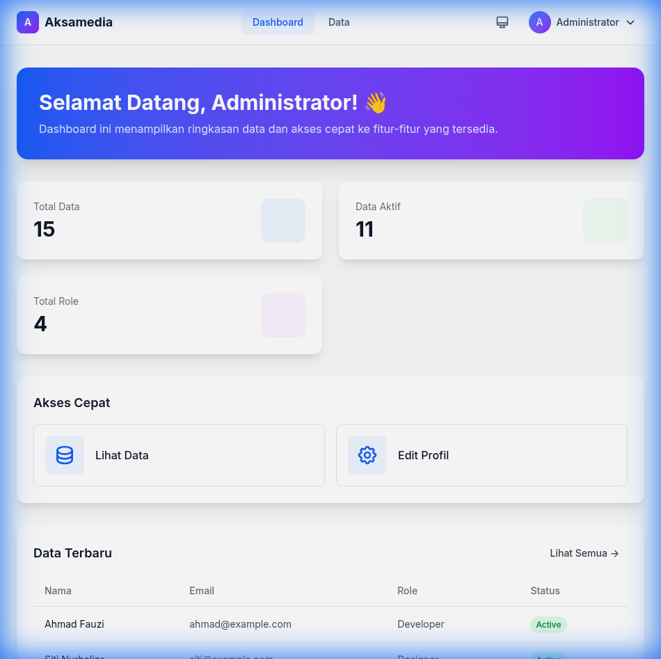
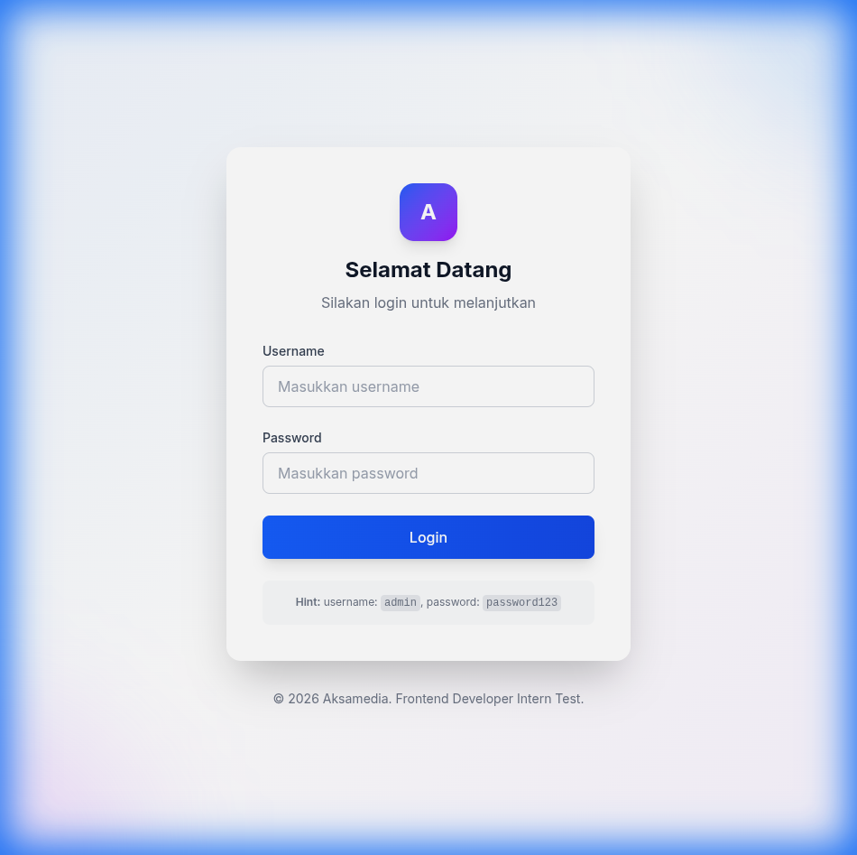
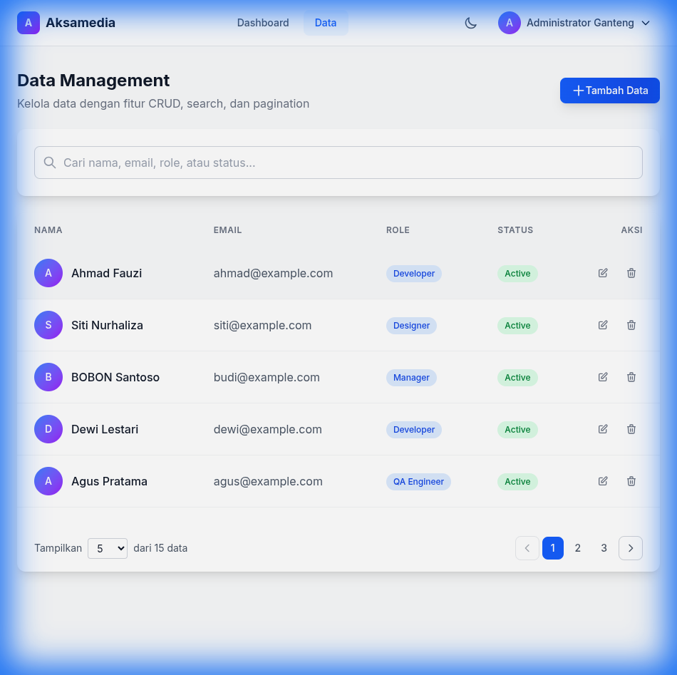
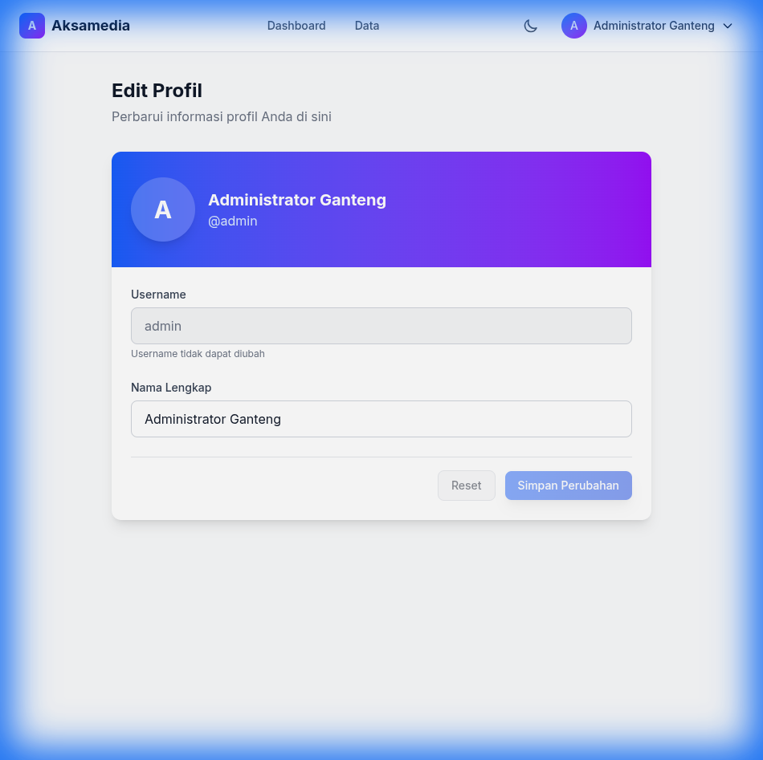

# 🚀 Aksamedia - Frontend Developer Intern Test

Aplikasi web CRUD dengan React dan Tailwind CSS untuk tes masuk magang Frontend Developer di PT Aksamedia Mulia Digital.



---

## 📋 Daftar Isi

- [Fitur](#-fitur)
- [Tech Stack](#-tech-stack)
- [Screenshots](#-screenshots)
- [Instalasi](#-instalasi)
- [Penggunaan](#-penggunaan)
- [Struktur Project](#-struktur-project)
- [Penjelasan Fitur](#-penjelasan-fitur)

---

## ✨ Fitur

### Authentication

- ✅ Login dengan static credentials (`admin` / `password123`)
- ✅ Session persist setelah refresh (menggunakan localStorage)
- ✅ Protected routes (halaman selain login hanya bisa diakses setelah login)
- ✅ Logout via dropdown custom di navbar

### CRUD (Create, Read, Update, Delete)

- ✅ Tampilan data dengan tabel responsive
- ✅ Fitur search/filter real-time
- ✅ Pagination custom (tanpa library pihak ketiga)
- ✅ State persistence via URL query string (`?page=3&search=Agus`)
- ✅ Data tersimpan di localStorage

### Dark Mode / Light Mode

- ✅ 3 pilihan tema: Dark, Light, System
- ✅ Mengikuti preferensi OS secara otomatis (jika pilih System)
- ✅ Tema tersimpan di localStorage

### User Profile

- ✅ Edit nama lengkap user
- ✅ Perubahan nama otomatis tampil di navbar
- ✅ Data tersimpan di localStorage

### UI/UX

- ✅ Responsive design (Desktop, Tablet, Mobile)
- ✅ Murni Tailwind CSS (tanpa UI library seperti Chakra, Material UI)
- ✅ Custom dropdown tanpa library
- ✅ Animasi smooth dan modern

---

## 🛠 Tech Stack

| Technology           | Keterangan                  |
| -------------------- | --------------------------- |
| **React 18**         | Library JavaScript untuk UI |
| **Vite**             | Build tool dan dev server   |
| **Tailwind CSS**     | Utility-first CSS framework |
| **React Router DOM** | Routing untuk SPA           |
| **localStorage**     | Penyimpanan data lokal      |

---

## 📸 Screenshots

### Halaman Login


_Halaman login dengan form username dan password. Terdapat hint credentials di bawah tombol login._

### Halaman Data Management


_Halaman CRUD dengan fitur search, pagination, dan tabel data responsive._

### Halaman Edit Profil


_Halaman untuk mengedit nama lengkap user. Perubahan akan langsung terlihat di navbar._


---

## 📦 Instalasi

### Prerequisites

- Node.js 18+
- npm atau yarn

### Steps

1. **Clone repository**

   ```bash
   git clone <repository-url>
   cd Aksamedia
   ```

2. **Install dependencies**

   ```bash
   npm install
   ```

3. **Jalankan development server**

   ```bash
   npm run dev
   ```

4. **Buka browser**
   ```
   http://localhost:5173
   ```

---

## 🔐 Penggunaan

### Login Credentials

```
Username: admin
Password: password123
```

### Fitur yang Bisa Dicoba

1. **Login** - Masukkan credentials di atas untuk masuk
2. **Dashboard** - Lihat ringkasan data dan statistik
3. **Data** - CRUD operations, coba search "Agus" dan navigasi pagination
4. **Profile** - Edit nama lengkap, perhatikan perubahan di navbar
5. **Theme** - Klik icon tema di navbar untuk switch dark/light mode
6. **Logout** - Klik nama user di navbar → Logout

### State Persistence Test

1. Buka halaman Data
2. Search "Agus" dan navigasi ke halaman 2
3. Perhatikan URL berubah menjadi `?page=2&search=Agus`
4. Refresh browser - state tetap tersimpan!

---

## 📁 Struktur Project

```
src/
├── components/
│   ├── CRUD/
│   │   ├── DataForm.jsx      # Form untuk create/edit data
│   │   ├── Pagination.jsx    # Komponen pagination custom
│   │   └── SearchFilter.jsx  # Komponen search dengan debounce
│   ├── Layout/
│   │   ├── Dropdown.jsx      # Custom dropdown tanpa library
│   │   ├── Navbar.jsx        # Navbar dengan theme switcher
│   │   └── ProtectedRoute.jsx # Route guard
│   └── UI/
│       ├── Button.jsx        # Reusable button component
│       ├── Input.jsx         # Reusable input component
│       ├── Modal.jsx         # Modal dan ConfirmModal
│       └── Select.jsx        # Reusable select component
├── contexts/
│   ├── AuthContext.jsx       # Authentication state management
│   ├── DataContext.jsx       # CRUD data management
│   └── ThemeContext.jsx      # Theme/dark mode management
├── hooks/
│   ├── useLocalStorage.js    # Hook untuk localStorage
│   └── useQueryParams.js     # Hook untuk URL query params
├── pages/
│   ├── Dashboard.jsx         # Halaman dashboard
│   ├── DataCreate.jsx        # Halaman tambah data
│   ├── DataEdit.jsx          # Halaman edit data
│   ├── DataIndex.jsx         # Halaman list data (CRUD)
│   ├── Login.jsx             # Halaman login
│   └── Profile.jsx           # Halaman edit profil
├── utils/
│   └── constants.js          # Konstanta dan data awal
├── App.jsx                   # Root component dengan routing
├── index.css                 # Tailwind CSS imports
└── main.jsx                  # Entry point
```

---

## 📝 Penjelasan Fitur

### 1. Authentication System

Sistem autentikasi menggunakan React Context API. Credentials bersifat statis dan disimpan di `constants.js`. Session user tersimpan di localStorage sehingga tetap login meskipun browser di-refresh.

```javascript
// Static credentials
username: "admin";
password: "password123";
```

### 2. CRUD dengan URL State Persistence

Halaman Data menggunakan `useSearchParams` dari React Router untuk menyimpan state pagination dan search di URL. Ini memungkinkan user untuk:

- Bookmark halaman dengan state tertentu
- Share link dengan state yang sama
- Tidak kehilangan posisi saat refresh

### 3. Dark Mode dengan System Preference

Theme context menggunakan `matchMedia` API untuk mendeteksi preferensi tema OS. Saat user memilih "System", aplikasi akan otomatis mengikuti perubahan tema OS secara real-time.

### 4. Custom Components

Semua komponen UI dibuat sendiri menggunakan Tailwind CSS tanpa library pihak ketiga:

- **Dropdown**: Click outside detection, keyboard escape handling
- **Modal**: Backdrop click, body scroll lock
- **Pagination**: Page numbers, prev/next, items per page

---

## 🚀 Build untuk Production

```bash
npm run build
```

Hasil build ada di folder `dist/`. Upload folder ini ke hosting platform seperti:

- Netlify
- Vercel
- GitHub Pages

---

## 👨‍💻 Author
Athariq Qur'ani Fajri

**Frontend Developer Intern Test**  
PT Aksamedia Mulia Digital

© 2026 Aksamedia
